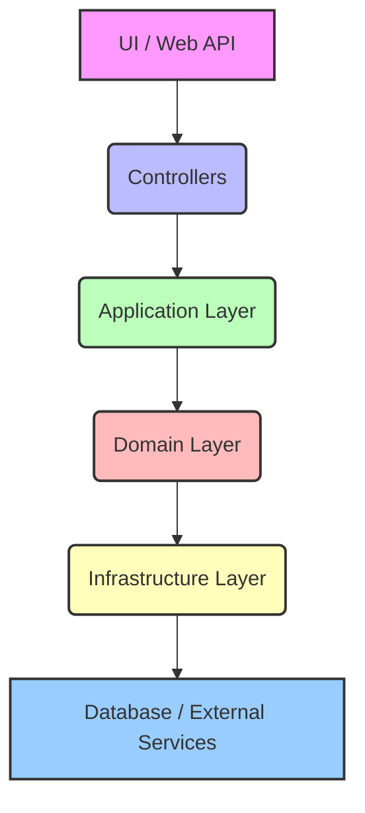

# 13-clean-architecture.md

# هندسة البرمجيات النظيفة (Clean Architecture)

## المقدمة

مع نمو تعقيد تطبيقات الويب، يصبح تنظيم الكود وهيكلته أمراً بالغ الأهمية للحفاظ على قابلية الصيانة، قابلية الاختبار، وقابلية التوسع. **هندسة البرمجيات النظيفة (Clean Architecture)** هي مجموعة من المبادئ التي تهدف إلى فصل اهتمامات التطبيق (Separation of Concerns) إلى طبقات مستقلة، مما يجعل التطبيق مرناً ومقاوماً للتغيير. تعتمد هذه الهندسة على مبدأ أن الكود يجب أن يكون مستقلاً عن أطر العمل (Frameworks)، قواعد البيانات، وواجهات المستخدم.

## 1. مبادئ Clean Architecture

تعتمد Clean Architecture على عدة مبادئ أساسية، أبرزها:

*   **استقلالية أطر العمل (Framework Independence):** يجب ألا يعتمد الكود الأساسي للتطبيق على أي إطار عمل خارجي (مثل ASP.NET Core MVC). هذا يسمح بتغيير إطار العمل بسهولة دون إعادة كتابة منطق العمل.
*   **استقلالية واجهة المستخدم (UI Independence):** يمكن تغيير واجهة المستخدم (Web, Desktop, Mobile) دون التأثير على منطق العمل الأساسي.
*   **استقلالية قاعدة البيانات (Database Independence):** يمكن تغيير قاعدة البيانات (SQL Server, MongoDB) دون التأثير على منطق العمل.
*   **استقلالية العوامل الخارجية (External Agency Independence):** يجب أن يكون منطق العمل مستقلاً عن أي عوامل خارجية مثل أنظمة الملفات أو الخدمات الخارجية.
*   **قواعد الاعتمادية (Dependency Rule):** هذا هو المبدأ الأكثر أهمية. يجب أن تشير الاعتماديات دائماً إلى الداخل. أي أن الطبقات الخارجية تعتمد على الطبقات الداخلية، ولكن الطبقات الداخلية لا يجب أن تعرف شيئاً عن الطبقات الخارجية.

## 2. الطبقات الأساسية في Clean Architecture

تُقسم Clean Architecture التطبيق إلى دوائر (Layers) أو طبقات، حيث تمثل الدوائر الداخلية سياسات عالية المستوى (High-level policies) وتمثل الدوائر الخارجية تفاصيل منخفضة المستوى (Low-level details). 



### أ. Domain Layer (الطبقة الأساسية / الكيانات)

*   **الهدف:** تحتوي على منطق العمل الأساسي للكيانات (Entities)، القواعد التجارية (Business Rules)، والاستثناءات الخاصة بالمجال. هي قلب التطبيق.
*   **المحتويات:** Entities, Value Objects, Aggregates, Domain Events, Interfaces for Repositories.
*   **الاعتماديات:** لا تعتمد على أي طبقة أخرى. يجب أن تكون مستقلة تماماً.

### ب. Application Layer (طبقة التطبيق / حالات الاستخدام)

*   **الهدف:** تحتوي على منطق العمل الخاص بحالات الاستخدام (Use Cases) للتطبيق. تنسق تدفق البيانات من وإلى الـ Domain Layer.
*   **المحتويات:** Application Services, DTOs (Data Transfer Objects), Commands, Queries, Handlers for Commands/Queries (مثل MediatR).
*   **الاعتماديات:** تعتمد على الـ Domain Layer. لا تعتمد على الـ Infrastructure أو الـ UI.

### ج. Infrastructure Layer (طبقة البنية التحتية)

*   **الهدف:** تحتوي على جميع التفاصيل التنفيذية الخارجية، مثل الوصول إلى قاعدة البيانات، الخدمات الخارجية، أنظمة الملفات، والتسجيل.
*   **المحتويات:** Implementations of Repository Interfaces, EF Core DbContext, External Service Clients, Logging Implementations.
*   **الاعتماديات:** تعتمد على الـ Domain Layer والـ Application Layer (لتنفيذ الواجهات المعرفة فيهما).

### د. Presentation Layer (طبقة العرض / واجهة المستخدم)

*   **الهدف:** هي الطبقة الخارجية التي يتعامل معها المستخدمون (أو تطبيقات أخرى). في سياق ASP.NET Core Web API، تكون هذه الطبقة هي مشروع الـ Web API نفسه.
*   **المحتويات:** Controllers, View Models (لـ MVC), Configuration for Dependency Injection, Middleware setup.
*   **الاعتماديات:** تعتمد على الـ Application Layer (لاستدعاء حالات الاستخدام) والـ Infrastructure Layer (لتكوين الخدمات).

## 3. تطبيق Clean Architecture في ASP.NET Core

عادةً ما يتم تقسيم المشروع إلى عدة مشاريع (Class Libraries) في Visual Studio أو .NET CLI، كل منها يمثل طبقة.

```
MyCleanArchitectureSolution/
├── src/
│   ├── MyProject.Domain/         # Domain Layer
│   ├── MyProject.Application/    # Application Layer
│   ├── MyProject.Infrastructure/ # Infrastructure Layer
│   └── MyProject.Api/            # Presentation Layer (ASP.NET Core Web API)
└── tests/
    └── MyProject.Application.Tests/ # Unit Tests for Application Layer
    └── MyProject.Domain.Tests/      # Unit Tests for Domain Layer
```

### مثال على تدفق الطلب

1.  **الطلب يصل إلى `MyProject.Api`:** يتم استقبال طلب HTTP بواسطة Controller في طبقة الـ Presentation.
2.  **الـ Controller يستدعي `MyProject.Application`:** يقوم الـ Controller بتحويل الـ DTO الوارد إلى Command أو Query ويستدعي Handler المناسب في طبقة الـ Application.
3.  **الـ Application Handler يتفاعل مع `MyProject.Domain`:** يقوم الـ Handler بتنفيذ منطق حالة الاستخدام، ويتفاعل مع الكيانات (Entities) وقواعد العمل المعرفة في طبقة الـ Domain.
4.  **الـ Domain Layer يستخدم `MyProject.Infrastructure` (عبر الواجهات):** إذا احتاج الـ Domain Layer إلى الوصول إلى البيانات، فإنه يستدعي واجهات Repositories المعرفة فيه. يتم تنفيذ هذه الواجهات في طبقة الـ Infrastructure.
5.  **الـ Infrastructure Layer يتفاعل مع قاعدة البيانات:** يقوم تطبيق الـ Repository في طبقة الـ Infrastructure بالتعامل مع EF Core أو أي تقنية وصول للبيانات لجلب أو حفظ البيانات.
6.  **الاستجابة تعود:** تعود البيانات من الـ Infrastructure إلى الـ Domain، ثم إلى الـ Application، ثم إلى الـ Presentation، حيث يتم تحويلها إلى DTO وإرجاعها كاستجابة HTTP.

## 4. فوائد Clean Architecture

*   **قابلية الاختبار العالية:** كل طبقة يمكن اختبارها بشكل مستقل، خاصة الـ Domain والـ Application Layers، حيث لا تعتمد على تفاصيل البنية التحتية.
*   **قابلية الصيانة:** التغييرات في طبقة واحدة لا تؤثر بالضرورة على الطبقات الأخرى، مما يقلل من مخاطر الأخطاء.
*   **قابلية التوسع:** سهولة إضافة ميزات جديدة أو تغيير التقنيات المستخدمة (مثل تغيير قاعدة البيانات أو إطار العمل).
*   **فصل الاهتمامات الواضح:** كل طبقة لها مسؤولية محددة وواضحة.
*   **كود مستقل عن التقنية:** منطق العمل الأساسي لا يعتمد على أي تقنية معينة، مما يجعله أكثر مرونة وطول عمر.

## 5. متى تستخدم Clean Architecture؟

Clean Architecture مفيدة بشكل خاص للمشاريع الكبيرة والمعقدة التي تتوقع أن تتطور بمرور الوقت. بالنسبة للمشاريع الصغيرة جداً، قد يكون تطبيقها مبالغاً فيه ويضيف تعقيداً غير ضروري. ومع ذلك، فإن فهم مبادئها يمكن أن يحسن تصميم أي تطبيق.

## الخلاصة

Clean Architecture هي منهجية قوية لتصميم تطبيقات ASP.NET Core قابلة للصيانة، قابلة للاختبار، وقابلة للتوسع. من خلال فصل اهتمامات التطبيق إلى طبقات مستقلة وتطبيق قاعدة الاعتمادية، يمكنك بناء أنظمة قوية ومرنة يمكنها التكيف مع المتطلبات المتغيرة. في الدرس التالي، سنقوم بتحديد مواصفات المشروع العملي الذي سنقوم بتطويره.
